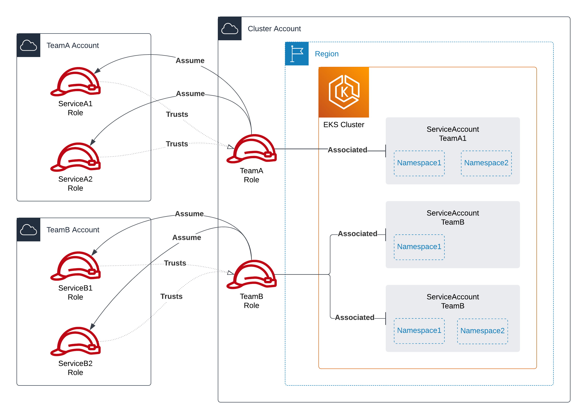

# Single Cluster, Multi-Account



There are two examples provided in this directory. One example uses two directories (`cluster-account` and `developer-account`) to demonstrate a scenario where Terraform state is in two separate locations for the two distinc acocunts; this would require coordination and two separate Terraform `apply`s. The other example uses a single directory (`single-state`) to demonstrate a scenario where Terraform state is in a single location for both accounts using aliased Terraform providers.

## Muti-State

### Order of Operatiions

## Single State

### Order of Operations

1. Change to the `single-state` directory:

    ```sh
    cd single-state
    ```

2. Initialize the Terraform workspace and apply the configuration to provision the defined resources:

    ```sh
    terraform init
    terraform apply # enter 'yes' when prompted
    ```

### Pros

- Easier to map dependencies correctly within Terraform to ensure resources are created in the correct order in a single apply

### Cons

- This might not be suitable for situations where a third team is involved that creates and manages IAM roles and permissions
- Can become unwiedly as the number of developer accounts increases
